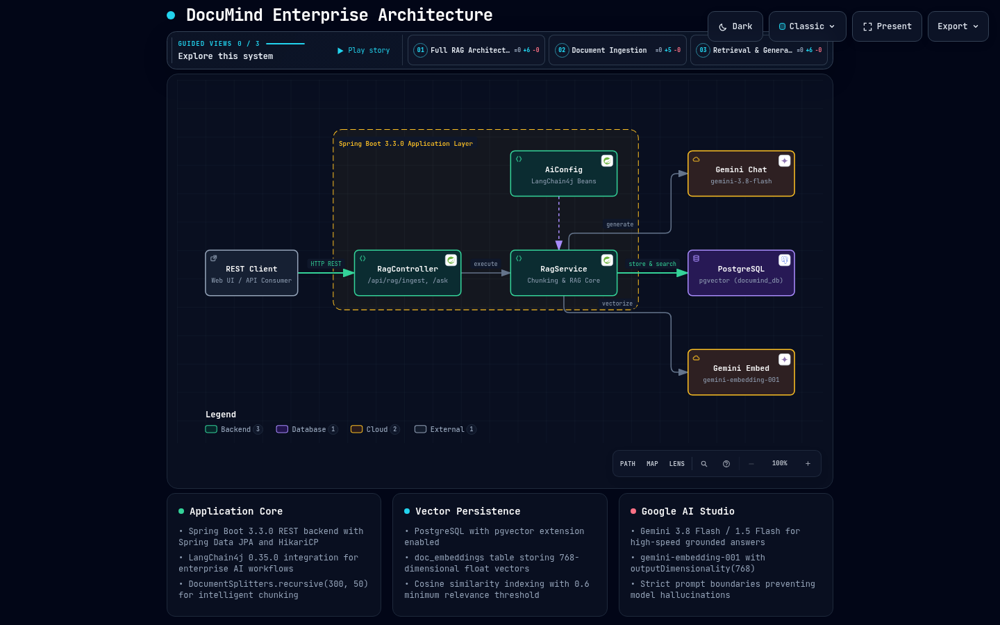

# DocuMind 🧠

> **Enterprise Retrieval-Augmented Generation (RAG) Knowledge Assistant** engineered with **Spring Boot 3.3.0**, **PostgreSQL pgvector**, **LangChain4j 0.35.0**, and a **Resilient Dual-Provider LLM Engine** (**Groq LPU** for sub-second inference + **Google Gemini** for multimodal reasoning & 768-d vector embeddings).

[](https://www.oracle.com/java/)
[](https://spring.io/projects/spring-boot)
[](https://github.com/langchain4j/langchain4j)
[](https://github.com/pgvector/pgvector)
[](https://groq.com/)
[](https://aistudio.google.com/)
[](LICENSE)

---

## 📌 Executive Overview

DocuMind is an enterprise knowledge assistant that converts private unstructured documentation (`.pdf`, `.txt`, `.md`, `.json`, `.csv`) into actionable intelligence with verified source citations.

Rather than relying on brittle keyword searches or Python scripting stacks, DocuMind is built on an **enterprise Java backbone** with strict compile-time type safety, production connection pooling, and resilient multi-provider orchestration:

- **Sub-Second RAG Generation**: Combines in-database cosine similarity search via `pgvector` with **Groq Cloud's LPU inference engine** (`llama-3.3-70b-versatile` / `openai/gpt-oss`), delivering complete answers in under 500ms.
- **Zero-Downtime Dual-Provider Failover**: A dynamic `ResilientFailoverChatModel` proxy routes queries to Groq by default, automatically and transparently failing over to Google Gemini if HTTP 429 rate limits or 503 outages occur.
- **Session-Isolated Conversational Memory**: Thread-safe, sliding-window memory (`MessageWindowChatMemory`) maintains multi-turn context per user session without leaking history or polluting database vectors.
- **Continuous Geometric Retrieval**: Solves vocabulary mismatch by converting text into 768-dimensional semantic coordinate vectors, ensuring queries match concepts by *meaning* rather than exact keywords.

---

## 🏛️ System Architecture



```
+---------------------------------------------------------------------------------------------------+
|                                  Spring Boot 3.3.0 Application                                    |
|                                                                                                   |
|  [Web UI / REST Client] ---> [ RagController ] ---> [ RagService ] <------- [ AiConfig ]         |
|         (:8080)                  (:8080)        |    (Core Engine)    (Provider Routing & Keys)   |
|                                                 |           |                                     |
|                                                 |   [ChatMemory Store]                            |
|                                                 |  (Per-Session History)                          |
+-------------------------------------------------+---+-------+-------------------------------------+
                                                 / \          |
                                                /   \         |
                       (Store / Search Vector) /     \        +------------------+
                                              v       \                          |
                     +----------------------------+    \ (Embeddings)            | (Inference)
                     |         PostgreSQL         |     v                        v
                     |          (pgvector)        |   +-------------------+    +--------------------+
                     |                            |   | Google AI Studio  |    |     Groq Cloud     |
                     | • Database: documind_db    |   |     (Gemini)      |    |     (LPU Engine)   |
                     | • Table: doc_embeddings    |   |                   |    |                    |
                     | • Dimension: 768           |   | • Embed: 768-d    |    | • Chat: LPU Model  |
                     | • Cosine distance index    |   |   gemini-embedding|    |   llama-3.3-70b    |
                     |                            |   | • Chat (Failover):|    | • Sub-500ms speed  |
                     |                            |   |   gemini-3.8-flash|    |                    |
                     +----------------------------+   +-------------------+    +--------------------+
```

> 📖 **Deep Dive Documentation:** For the complete technical blueprint, sequence diagrams, and design pattern study guide, see [docs/ARCHITECTURE.md](docs/ARCHITECTURE.md) and the interactive [docs/documind-architecture.html](docs/documind-architecture.html).

---

## ⚡ Core Engineering Highlights (Resume Architecture Deep-Dive)

### 1. Cloud-Native RAG Intelligence (Spring Boot + Supabase PostgreSQL + pgvector)
> 🎯 **Resume Highlight:** *Engineered a cloud-native RAG document intelligence platform using Spring Boot and Supabase PostgreSQL with the pgvector extension for high-performance vector similarity search and context retrieval.*

DocuMind provides an enterprise, cloud-native document intelligence platform powered by Spring Boot 3.3.0 and Supabase PostgreSQL with the `pgvector` extension:
- **Cloud-Native Connection & Normalization**: Implemented in [`DatabaseConfig.java`](src/main/java/com/ai/documind/config/DatabaseConfig.java), a custom HikariCP connection factory automatically normalizes cloud connection strings (Supabase, Render, Railway), cleanly separating special-character credentials (`#`, `@`, `%`) from JDBC connection endpoints to prevent URI parsing failures and auto-enforcing `sslmode=require` for encrypted transit.
- **In-Database Semantic Vector Space**: Instead of managing separate vector silos (like Pinecone or Chroma) which introduce latency and synchronization complexity, DocuMind stores high-dimensional embeddings directly inside the relational database (`doc_embeddings` schema: `UUID id, vector(768) embedding, text TEXT, metadata JSONB`).
- **High-Performance Cosine Distance Retrieval**: Vector similarity searches execute natively inside PostgreSQL using the Cosine Distance operator (`<=>`), optimized with **HNSW (Hierarchical Navigable Small World)** indexes for sub-millisecond nearest-neighbor retrieval across enterprise document corpuses.
- **Context Retrieval & Confidence Filtering**: Candidate chunks are scored via cosine similarity (`1 - cosine_distance`), filtered against a strict confidence threshold (`minScore = 0.5`), and top-K matches (`topK = 4`) are dynamically fed into the LLM context window.

### 2. Resilient Dual-Provider AI Engine (LangChain4j + Groq + Gemini)
> 🎯 **Resume Highlight:** *Implemented a resilient dual-provider AI architecture via LangChain4j integrating Groq and Google Gemini APIs with automated fallback heuristics and context-aware citation tracking.*

Enterprise production systems cannot tolerate single-provider outages or HTTP 429 rate limit throttling. In [`AiConfig.java`](src/main/java/com/ai/documind/config/AiConfig.java), DocuMind leverages LangChain4j 0.35.0 to build a resilient, dual-provider architecture:
- **Sub-Second Primary Generation (Groq LPU)**: Utilizes Groq Cloud's custom LPU (Language Processing Unit) architecture targeting `openai/gpt-oss-120b` and `llama-3.3-70b-versatile`, delivering 500+ tokens/sec with sub-500ms time-to-first-token.
- **Multimodal & Embedding Backbone (Google Gemini)**: Couples Gemini's reasoning (`gemini-3.8-flash`) for failover generation with `gemini-embedding-001` for deterministic 768-dimensional coordinate vector synthesis.
- **Automated Fallback Heuristics (GoF Proxy Pattern)**: The `ResilientFailoverChatModel` proxy intercepts model invocations in real-time. It catches transient HTTP 429 rate limits, HTTP 503 service unavailable spikes, and network timeouts from the primary provider, transparently re-routing the query to Gemini in-flight without dropping user sessions or throwing 500 server errors.
- **Context-Aware Citation Tracking**: Every synthesized response tracks chunk-level provenance, binding document text, source file name, and similarity match percentage (`score * 100`) directly to the answer. Answers are strictly conditioned on retrieved context to eliminate hallucinations.

### 3. Responsive Minimal Dark-Mode Frontend & Ingestion/Deletion Pipeline
> 🎯 **Resume Highlight:** *Built a responsive, minimal dark-mode frontend featuring global keyboard shortcuts, dynamic chunking ingestion, and real-time document inventory deletion pipeline.*

The user interface is an ultra-minimalist, single-file frontend served natively by Spring Boot (`src/main/resources/static/index.html`):
- **Anti-AI Minimalist Aesthetic**: Monochromatic design system inspired by Linear and Vercel (deep charcoal `bg-zinc-950`, crisp `border-zinc-800`, zero purple neon gradients), custom inline SVG favicons (`> _`), and crisp developer typography (`'Inter'`, `-apple-system`, subpixel antialiasing).
- **Global Keyboard Shortcuts & Micro-Interactions**: Features ChatGPT-style type-anywhere auto-focus (typing any alphanumeric key immediately focuses the chat input), Enter-to-send with Shift+Enter for newlines, and an auto-expanding textarea that stays compact at single-line (36px) and gracefully expands up to 160px.
- **Dynamic Chunking Ingestion**: Drag-and-drop file ingestion drawer with dual parsers (`ApachePdfBoxDocumentParser` for structural PDFs and `TextDocumentParser` for `.txt`, `.md`, `.json`, `.csv`). Employs overlapping recursive segmentation (`DocumentSplitters.recursive(800, 150)`) to maintain semantic coherence across chunk boundaries.
- **Real-Time Document Inventory & Deletion Pipeline**: Live document store drawer (`GET /api/rag/documents`) showing active indexed files, chunk counts, and file sizes. Provides targeted document deletion (`DELETE /api/rag/documents/{fileName}`) to atomically purge embeddings from PostgreSQL via JSONB metadata queries (`DELETE FROM doc_embeddings WHERE metadata->>'file_name' = ?`), along with full vector store truncation (`DELETE /api/rag/documents`) and idempotent re-upload protection.

### 4. Enterprise Java vs. Script-based Python
| Engineering Dimension | Scripted Python (LangChain / FastAPI) | DocuMind (Spring Boot 3.3 + LangChain4j) |
| :--- | :--- | :--- |
| **Type Safety** | Dynamic typing; runtime dimension/schema crashes | Strict compile-time contracts prevent vector mismatches |
| **Concurrency** | Python GIL bottlenecks; complex worker multiprocessing | JVM virtual threads & native thread pools handle high throughput |
| **Database Pool** | Ad-hoc connection handling | Production **HikariCP** pool with transactional safety & cloud SSL |
| **Deployment** | Fragile virtual environments & C-wheel compilation drift | Single, self-contained containerized executable JAR |

### 5. Session-Isolated Conversational Memory
Multi-turn context is managed through `MessageWindowChatMemory` keyed by `sessionId`:
- Preserves the last 10 conversational turns for natural back-and-forth dialogue.
- Insulates conversational history from raw RAG vector storage, preventing prompt context bloat.
- Dedicated endpoints allow frontend clients to view or flush session memory on demand.

---

## 🛠️ Tech Stack Matrix

| Layer | Technology | Version | Purpose |
| :--- | :--- | :--- | :--- |
| **Backend Framework** | Spring Boot | `3.3.0` | Enterprise REST gateway, dependency injection, and transaction management |
| **RAG Orchestration** | LangChain4j | `0.35.0` | Document parsing, recursive chunking, chat memory, and model binding |
| **Vector Database** | PostgreSQL + pgvector | `16 / pgvector` | High-dimensional vector storage and HNSW cosine distance indexing |
| **Primary LLM** | Groq Cloud LPU | `llama-3.3-70b` | Sub-500ms ultra-low latency contextual generation |
| **Multimodal & Embeddings** | Google Gemini | `gemini-3.8-flash` | Multimodal comprehension, failover chat, and 768-d text embeddings |
| **Document Parsers** | Apache PDFBox / Core | `3.3.0` | Deep structural text extraction from PDFs, Markdown, TXT, and CSV |
| **Frontend UI** | HTML5 / Vanilla CSS / JS | Modern | Responsive glassmorphic chat interface with real-time source citations |

---

## 🚀 Quick Start Guide

### 1. Prerequisites
- **Java 17+**: `java --version`
- **Maven 3.8+**: `mvn --version`
- **Docker**: `docker --version`

### 2. Start PostgreSQL with pgvector
Launch the pre-configured vector database container:

```bash
docker run -d \
  --name documind-db \
  -e POSTGRES_DB=documind_db \
  -e POSTGRES_USER=admin \
  -e POSTGRES_PASSWORD=admin \
  -p 5432:5432 \
  pgvector/pgvector:pg16
```

### 3. Configure Environment Variables
Copy the template and provide your API keys:

```bash
cp .env.example .env
```

Edit `.env`:
```properties
# Database
DB_USERNAME=admin
DB_PASSWORD=admin
DATABASE_URL=jdbc:postgresql://localhost:5432/documind_db

# AI Provider Routing (auto | groq | gemini)
AI_PROVIDER=auto

# API Keys
GEMINI_API_KEY=AQ.your_gemini_api_key_here
GROQ_API_KEY=gsk_your_groq_api_key_here
```

### 4. Build and Run the Application
```bash
./mvnw clean spring-boot:run
```

Once started, open your browser at **`http://localhost:8080`** to access the built-in DocuMind Chat UI.

---

## 📡 REST API Reference

### 1. Multipart Document Upload
Upload `.pdf`, `.txt`, or `.md` files for recursive chunking and vector storage:
```bash
curl -X POST http://localhost:8080/api/rag/upload \
  -F "file=@company_policy.pdf"
```
**Response (200 OK):**
```json
{
  "fileName": "company_policy.pdf",
  "fileSize": 45200,
  "chunksCount": 11,
  "message": "Successfully parsed and stored 11 segments into pgvector.",
  "success": true
}
```

### 2. Ask Contextual Question (Multi-Turn RAG)
Query uploaded knowledge with session-isolated dialogue memory:
```bash
curl -X POST http://localhost:8080/api/rag/ask \
  -H "Content-Type: application/json" \
  -d '{
    "question": "What is the policy for annual vacation days?",
    "sessionId": "session-dev-01"
  }'
```
**Response (200 OK):**
```json
{
  "answer": "Full-time employees accrue 20 days of paid annual leave per calendar year, increasing to 25 days after 3 years of service.",
  "sessionId": "session-dev-01",
  "sources": [
    {
      "fileName": "company_policy.pdf",
      "score": 0.842,
      "text": "Full-time employees accrue 20 days of paid annual leave per calendar year..."
    }
  ]
}
```

### 3. Inspect Session Chat History
```bash
curl -X GET http://localhost:8080/api/rag/chat/session-dev-01/history
```

### 4. Reset Session Memory
```bash
curl -X DELETE http://localhost:8080/api/rag/chat/session-dev-01
```

### 5. Document Inventory Inspection
Retrieve metadata on all active indexed documents:
```bash
curl -X GET http://localhost:8080/api/rag/documents
```
**Response (200 OK):**
```json
[
  {
    "fileName": "company_policy.pdf",
    "chunkCount": 11,
    "fileSize": 45200
  }
]
```

### 6. Purge Specific Document Chunks
Atomically remove a document and its associated vector embeddings from PostgreSQL:
```bash
curl -X DELETE http://localhost:8080/api/rag/documents/company_policy.pdf
```
**Response (200 OK):**
```json
{
  "message": "Successfully purged embeddings for document: company_policy.pdf",
  "deletedChunks": 11
}
```

### 7. Truncate Entire Vector Store
Purge all embeddings across all indexed documents:
```bash
curl -X DELETE http://localhost:8080/api/rag/documents
```

### 8. Inspect pgvector Stored Chunks (Direct SQL)
```bash
# Count total chunks in pgvector
docker exec -it documind-db psql -U admin -d documind_db -c "SELECT COUNT(*) FROM doc_embeddings;"

# List distinct uploaded files
docker exec -it documind-db psql -U admin -d documind_db -c "SELECT DISTINCT metadata->>'file_name' FROM doc_embeddings;"
```

---

## 📂 Project Structure

```
documind/
├── .env.example                               # Safe configuration template (Zero-Secret Policy)
├── docs/                                      # Enterprise Documentation & Diagrams
│   ├── ARCHITECTURE.md                        # Exhaustive technical reference & design guide
│   ├── documind-architecture.html             # Standalone interactive architecture viewer
│   └── documind-architecture.visual-check.1440x900.dark.png # Embedded architecture diagram
├── src/main/java/com/ai/documind/
│   ├── config/
│   │   └── AiConfig.java                      # Dual-provider router, key resolver & failover proxy
│   ├── controller/
│   │   └── RagController.java                 # REST API endpoints (upload, ask, memory, purge)
│   ├── service/
│   │   └── RagService.java                    # Core RAG pipeline, PDF parsing & pgvector retrieval
│   └── DocumindBackendApplication.java        # Spring Boot entry point
├── src/main/resources/
│   ├── application.properties                 # Spring & PostgreSQL configuration
│   └── static/
│       └── index.html                         # Built-in chat & document upload web UI
└── pom.xml                                    # Maven dependencies (Spring Boot, LangChain4j, pgvector)
```

---

## 🔒 Security & Zero-Secret Policy

DocuMind enforces a strict **Zero-Secret VCS Policy**:
- `.env` and local credentials are permanently excluded via `.gitignore`.
- CI/CD and production environments populate configuration via OS environment variables.
- Configuration placeholders are sanitized in [`.env.example`](.env.example).
- Application properties use safe defaults: `${GEMINI_API_KEY:}` and `${GROQ_API_KEY:}`.

---

## 📄 License

This project is licensed under the MIT License — see the [LICENSE](LICENSE) file for details.
